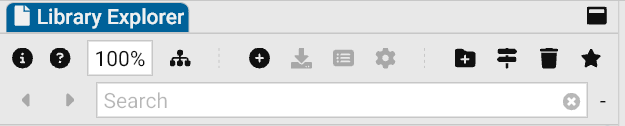
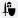

In GCS, **libraries** hold all the traits, skills, spells, equipment, and other content you'll add to your [character sheet](Character%20Sheet%20Overview) to build characters.

- The **Master Library** comes with GCS and includes official GURPS content.
- The **User Library** is where you save and organize your own custom content.
- You can also create **Favorites** to quickly open the libraries you use most often.

All of these are available in the **Library Explorer** on the left sidebar of the GCS window.

To explore libraries:

- Select the arrows  to expand or collapse folders.
- Double-click a folder to open it.
- Select **Expand/Collapse All**  on the toolbar to open or close all folders at once.

To open a library:

- Double-click it. The library opens in the **Document Workspace** as its own tab.

## Favorites

If you use a library often, mark it as a **Favorite** so it's always at the top of the Library Explorer.

To create a favorite:

- Select the library and select **Favorite**  on the toolbar, or
- Right-click the library and select **Toggle Favorite**.

The library will now appear in the **Favorites folder**. To remove it, repeat the same steps.

> [!important]
> You can only favorite whole libraries, not individual items inside them.

## Master Library

The **Master Library** is the built-in collection that comes with GCS. It includes hundreds of official traits, skills, spells, and equipment taken from GURPS books and other supplements. Many items include notes and explanations, and when added to your sheet they automatically adjust your stats and [points](Character%20points) for you.

> [!tip]
> Use the **Search** bar on the toolbar to search for content by name. Press `Enter` on your keyboard or use the arrows next to Search to cycle through results.
>
> You can also search for individual items within libraries by enabling **Library Explorer Deep Search** in [General Settings](General%20Settings).

The Master Library is updated regularly. You can see the current version number next to its name (for example, _v5.8_).

To update the Master Library:

- Select the Master Library, then select **Update**  on the toolbar.
- To see what's new, select **Release Notes** .

> [!caution] > **Do not** make changes directly in the Master Library. Updates replace the entire library, and your edits will be lost. If you want to customize something, copy it into your User Library first.

By default, content from the Master Library is saved in: `<home directory> > GCS > Master Library`.

> [!tip]
> The tab toolbar on the top of a library contains some useful tools:
>
> - **Search:** Use the **Content Filter** to search for a trait by name.
> - **Filter:** Use the **Tag filter** to filter by [Tags](../User%20Guide/Tags) (e.g., Advantage, Disadvantage, spell college, etc.). These options change based on the type of library.

## User Library

The **User Library** is your personal space for [custom content](Custom%20Content). It’s where you keep anything that belongs to _you_ rather than the official Master Library, such as:

- Saved [character sheets](Character%20Sheet%20Overview)
- Homebrew traits, skills, spells, or equipment
- [Notes](Notes) related to your character or game
- Anything you don’t want to lose when GCS updates

By default, your User Library is saved in: `<home directory> > GCS > User Library`.

Anything saved here will not change when the Master Library updates.

> [!tip]
> Right-click a library or other document type and select **Show on Disk** to open the file location on your computer.

### Creating or Importing Libraries

You can create your own libraries or import them from others.

- **Create a new library:** Go to **File > New `<type>` Library**. Choose the type (traits, skills, equipment, etc.), and GCS will open a new library window for you to add [custom content](Custom%20Content). Once you add at least one item and save it, the new library will appear in your User Library.
- **Import an existing library:** If you’ve downloaded a library (or received one from another player), select **File > Open**, choose the file, and then save it into your User Library.

### Deleting Libraries and Files

> [!caution]
> When you delete a library or file, GCS **permanently deletes** the file from your computer, not just from the Library Explorer.

To delete a library or file:

- Select the file and select **Delete**  on the toolbar, or
- Right-click the the library and select **Delete**.

## Library Explorer toolbar

The toolbar above the Library Explorer gives you quick access to common actions depending on what's selected:

| Button                                                             | Name                      | Description                                         |
| ------------------------------------------------------------------ | ------------------------- | --------------------------------------------------- |
|                                  | **Help**                  | Open the help page from the User Guide.             |
| 100%                                                               | **Zoom**                  | Change the text size in the Library Explorer.       |
|                              | **Expand/Collapse All**   | Show or hide all folders at once.                   |
|                            | **Add Library**           | Create a new library.                               |
|               | **Update Master Library** | Replace the Master Library with the latest version. |
|  | **Release Notes**         | See what’s new in the latest Master Library update. |
|                        | **Configure**             | Open advanced settings for the selected library.    |
|                       | **New Folder**            | Create a new folder to organize libraries.          |
|                                | **Rename**                | Update the name of a library.                       |
|                              | **Delete**                | Permanently delete the library from your computer.  |
|                          | **Favorite**              | Add or remove the selected library from Favorites.  |
| N/A                                                                | **Search**                | Search for a specific library by name.              |

## Library Types

Each library and document type in GCS has its own file extension and icon. Here’s what you’ll see in the Library Explorer:

| Document Type              | Icon                                                              | Extension(s)           | Description                                                                                           |
| -------------------------- | ----------------------------------------------------------------- | ---------------------- | ----------------------------------------------------------------------------------------------------- |
| **Character Sheet**        |                  | `.gcs`                 | Complete characters you build and play. See [Character Sheet Overview](Character%20Sheet%20Overview). |
| **Character Template**     |                      | `.gct`                 | Templates you can reuse for new characters. See [Character templates](Character%20templates).         |
| **Loot Sheet**             |                                     | `.loot`                | List to track [Loot](Loot%20Sheets) obtained during play.                                             |
| **Trait**                  |                           | `.adq`                 | [Traits](Traits) including Advantages, disadvantages, and quirks libraries.                           |
| **Trait Modification**     |      | `.adm`                 | [Trait Modifiers](Trait%20Modifiers).                                                                 |
| **Skill**                  |                          | `.skl`                 | [Skills](Skills) library.                                                                             |
| **Spell**                  |                             | `.spl`                 | [Spells](Spells) library.                                                                             |
| **Equipment**              |                    | `.eqp`                 | [Equipment](Equipment) library.                                                                       |
| **Equipment Modification** |  | `.eqm`                 | [Equipment Modifiers](Equipment%20Modifiers).                                                         |
| **Note**                   |                            | `.not`                 | [Notes](Notes)                                                                                        |
| **Markdown**               |                | `.md`                  | Notes written in [Markdown](Markdown%20Guide) format.                                                 |
| **PDF**                    |                          | `.pdf`                 | PDFs.                                                                                                 |
| **Image**                  |                      | `.gif`, `.jpg`, `.png` | Images or graphics.                                                                                   |

## Library Settings

Most players won’t need this, but advanced users can connect their libraries to a GitHub repository to share content with others.

---

[Return to Home](Home)
