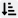

The **Trait list** on your [character sheet](Character%20Sheet%20Overview) includes all your **advantages** (p. B32) and **disadvantages** (p. B119).

### Master Library

GCS includes hundreds of official traits in the **Master Library** that are taken from GURPS books and other supplements. See [Library Explorer](Library%20Explorer) for more details.

You can also create your own custom traits.

## Trait list

The trait list on your character sheet includes the following columns. Select a column heading to sort ascending  or descending .

| Column                                    | Description                                                                                                                                                 |
| ----------------------------------------- | ----------------------------------------------------------------------------------------------------------------------------------------------------------- |
| **Trait**                                 | The trait name and any notes or control rolls. Select the notes icon  to open or close the notes for this trait.     |
| **Pts**                                   | Total [character point](Character%20points) cost for the trait.                                                                                             |
|  | Page reference for the trait. See [Page References](Page%20References) for more details.                                                                    |
|         | Tracks whether the trait matches the official **Master Library**. See _Master Library Syncing_ in [Character Sheet Overview](Character%20Sheet%20Overview). |

> [!TIP]
> From the character sheet toolbar, you can quickly expand or collapse traits and notes:
>
> - **Expand/Collapse All**  shows or hides all traits within containers.
> - **Open/Close All Notes**  shows or hides all embedded [Notes](Notes).

## Adding traits

To add an advantage or disadvantage:

1. Open a Trait library from the **Master Library**.
2. Choose the trait you want.
3. Add the trait in one of two ways:
   - Drag it from the library to your sheet, or
   - Right-click it and select **Copy to Character Sheet**.

You can also [create a new custom trait](Custom%20Content):

- On your character sheet, go to **Item > New Trait**.

When you add a trait:

- GCS highlights the block where it can be dropped. No matter where you drag it, it goes to the right location.
- The **Points block** updates automatically:
  - Advantages subtract from unspent points.
  - Disadvantages (negative points) add to unspent points.
- Some traits include **substitutions** (for example, `@details@`). You can set these when first adding the trait, or later with **Set Substitutions**  in the toolbar or by editing the notes directly in the **Trait Editor**.
- Some traits support multiple **modifiers**. When you first add a trait that has modifiers, GCS prompts you to select them. You can select one, several, or none. If you skip this step, you can add or edit modifiers later in the **Trait Detail Editor**. See [Trait Modifiers](Trait%20Modifiers) for more details.

## Managing traits

You can change traits on your sheet in a few ways.

### Increasing or decreasing a trait’s level

To increase a trait’s level:

- Right-click the trait on your character sheet and select **Increment**, or
- Go to **Edit > Increment**.

To decrease a trait’s level:

- Right-click the trait and select **Decrement**, or
- Go to **Edit > Decrement**.

GCS automatically recalculates the total point cost when you increase or decrease a level.

### Organizing traits with containers

You can group traits (advantages, disadvantages, etc.) into [Containers](Containers) for easier management.

For example:

- Put **Combat Reflexes** and **High Pain Threshold** into a “Combat Traits” container.
- Use **Alternate Abilities** or **Meta-trait** container types to apply special grouping rules.
- You can also use containers when building [Character templates](Character%20templates) to require a user take a certain point value of advantages and disadvantages.

### Deleting a trait

To delete a trait:

- Right-click it and select **Delete**, or
- Go to **Edit > Delete**.

## Editing traits

You can edit a trait in a few ways:

- Double-click it to open the **Detail Editor** for traits.
- Right-click it and select **Open Detail Editor**.
- Select a trait and go to **Edit > Open Detail Editor**.

Save your changes when you're done from the **Trait toolbar** (see below).

## Trait Detail Editor fields

The Trait Detail Editor includes the following fields:

| Trait Editor Field          | Description                                                                                                                                                                                                                            |
| --------------------------- | -------------------------------------------------------------------------------------------------------------------------------------------------------------------------------------------------------------------------------------- |
| **Name**                    | The trait's name.                                                                                                                                                                                                                      |
| **Notes**                   | Notes about what the trait does. These appear below the trait in the list. Select the Scripting Guide  for instructions on how to include JavaScript. Supports [Markdown](Markdown%20Guide). |
| **VTT Notes**               | Notes for use in your Virtual Tabletop system. See your VTT’s documentation.                                                                                                                                                           |
| **User Description**        | Additional notes for your reference. These appear as a tooltip when you hover.                                                                                                                                                         |
| **Tags**                    | Comma-separated [Tags](Tags) to help organize traits.                                                                                                                                                                                  |
| **Enabled**                 | If checked, the trait applies to your sheet.                                                                                                                                                                                           |
| **Point Cost**              | Ready-only. Total cost of the trait, with levels and modifiers applied.                                                                                                                                                                |
| **Round Down**              | If checked, rounds the total point cost down.                                                                                                                                                                                          |
| **Base Cost**               | The cost before modifiers or levels.                                                                                                                                                                                                   |
| **Levels**                  | If checked, the trait uses levels.                                                                                                                                                                                                     |
| **Cost Per Level**          | Point cost per level.                                                                                                                                                                                                                  |
| **Self-Control Roll**       | The self-control roll to resist (p. B120). The CR rating will show in parenthesis on your character sheet.                                                                                                                             |
| **Self-Control Adjustment** | Adjustments tied to self-control rolls, such as reaction or fright check penalties.                                                                                                                                                    |
| **Frequency of Appearance** | Sets how often the trait’s subject (such as an Ally, Contact, or Enemy) appears in play (p. B36).                                                                                                                                      |
| **Page Reference**          | Page number for the trait. See [Page References](Page%20References) for details.                                                                                                                                                       |
| **Page Highlight**          | Text to highlight in the PDF. Leave blank unless the default highlights fail.                                                                                                                                                          |
| **ID**                      | The trait’s unique ID.                                                                                                                                                                                                                 |
| **Source ID**               | The trait’s unique ID in the source library.                                                                                                                                                                                           |
| **Source Library**          | The name of the source library.                                                                                                                                                                                                        |
| **Source Path**             | The path to the source library.                                                                                                                                                                                                        |
| **Prerequisites**           | Any requirements for this trait. See [Prerequisites](Prerequisites).                                                                                                                                                                   |
| **Features**                | Lists attribute, conditions, skill, spell, reaction, or weapon changes applied by the trait. See [Features](Features).                                                                                                                 |
| **Trait Modifier**          | Modifiers that apply to the trait. You can enable a modifier to apply it to your sheet. See [Trait Modifiers](Trait%20Modifiers).                                                                                                      |
| **Melee Weapon Usage**      | Lists melee weapon statistics (p. B268), including skill defaults. See [Melee and Ranged Weapons](Melee%20and%20Ranged%20Weapons).                                                                                                     |
| **Ranged Weapon Usage**     | Lists ranged weapon statistics (p. B268), including skill defaults. See [Melee and Ranged Weapons](Melee%20and%20Ranged%20Weapons).                                                                                                    |
| **Study**                   | Allows you to track study time for this trait. See [Study time](Study%20time).                                                                                                                                                         |

## Trait toolbar

The toolbar above the Trait Editor gives you quick access to common actions:

| Button                                     | Name                  | Description                                                                                                                                |
| :----------------------------------------- | --------------------- | ------------------------------------------------------------------------------------------------------------------------------------------ |
|              | **Help**              | Opens the help page from the User Guide.                                                                                                   |
| 100%                                       | **Zoom**              | Adjusts the display size of the Trait Editor.                                                                                              |
|    | **Apply Changes**     | Saves and closes the Trait Editor.                                                                                                         |
|  | **Discard Changes**   | Exits without saving changes.                                                                                                              |
|   | **Set Substitutions** | Lets you enter values for traits with placeholders in their notes. For example, for _Enemy_ you can replace `@enemy@` with the foe's name. |

> [!NOTE]
> When you first add a trait with substitutions, a pop-up appears for you to fill them in.  
> If you skip it, you can set them later with **Set Substitutions** or by editing the text directly in the notes field.

## Customizing the Trait Layout

You can change how traits are displayed by editing the **block layout** in your sheet settings. See [Sheet Settings](Sheet%20Settings).

---

[Return to Home](Home)
