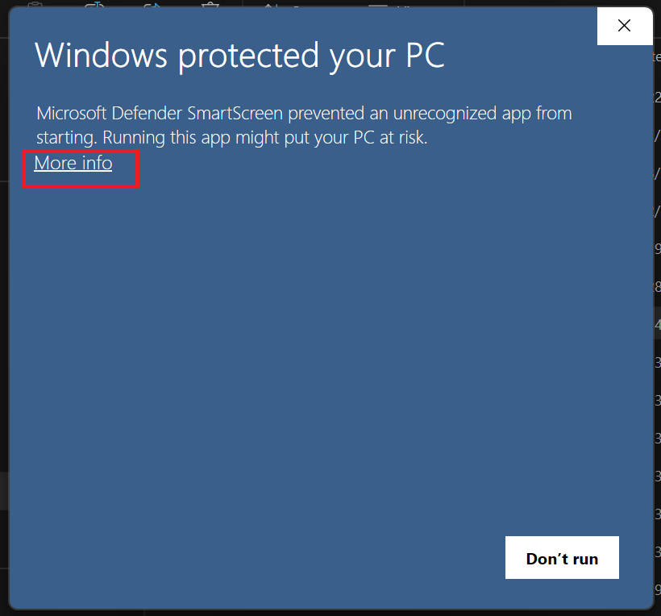

This section lists common problems you might run into while using GCS, along with their causes and how to fix them.

## General Troubleshooting Steps

Before trying the issue-specific fixes below, you may want to try these quick steps. They solve many common problems:

1. **Restart GCS:** Close the program completely and reopen it.
2. **Reboot your computer:** A fresh start often clears up stuck processes or memory issues.
3. **Check for updates:** Make sure you’re running the latest version of GCS and that your operating system is up to date.

> [!NOTE]
> If you don't see your issue listed here, you can:
>
> - Ask for help in the [GCS Discord community](https://discord.gg/MKhuDPPagY).
> - Report a bug or request a feature by [creating an issue on GitHub](https://github.com/richardwilkes/gcs/issues).

## List of common issues and steps to fix:

- Some windows or tabs are missing in GCS
- Page references open to the wrong page in a PDF
- "Windows protected your PC" warning appears when launching GCS
- GCS doesn't start on Windows
- GCS is very slow to start
  - Character sheets appear much smaller than 100%

---

## Issue: Some windows or tabs are missing in GCS

**Cause:** A window inside GCS has been maximized. When this happens, it fills the whole Document Workspace and hides any other open windows or tabs.

**How to fix:**

1. Select **Restore**  on the **top-right corner** of the maximized window.
2. The window will shrink back to its normal size, and any other open windows or tabs will reappear.

---

## Issue: Page references open to the wrong page in a PDF

**Cause:** The PDF likely includes extra pages at the beginning (such as covers or front matter) that shift the page numbering.

**How to fix:**

1. Go to **Settings > Page Reference Mappings**.
2. Update the page offset for the impacted PDF to match the difference. Use a positive offset if the PDF has extra pages at the beginning, or a negative offset if it starts later.

> **Example:** If selecting _B16_ opens your PDF to page 14, set the page offset to `+2` to account for the two-page difference.

See [Page References](Page%20References) for more details.

---

## Issue: “Windows protected your PC” warning appears when launching GCS

**Cause:** Windows Defender SmartScreen is blocking the app because it doesn’t recognize the publisher. This often happens the first time you run new software that isn’t signed with a Microsoft certificate.

**How to fix:**

1. On the warning window, select **More info**.
2. Select **Run anyway**.
3. GCS will launch normally. You won’t see this warning again for that version.

> [!NOTE]
> This message may appear each time you [update](Installing%20and%20Updating%20GCS) GCS to a new version.

| Warning Window - More info                      | Warning Window - Run anyway                     |
| ----------------------------------------------- | ----------------------------------------------- |
|  |  |

---

## Issue: GCS doesn’t start on Windows

**Cause:** There are a few common reasons this can happen:

1. Your system doesn’t support **OpenGL 3.2 or higher** (required by GCS).
2. GCS may already be running in the background without a visible window.

**How to fix:**

1. **Check OpenGL support:**
   - Make sure your graphics drivers are up to date and your system supports OpenGL 3.2+.
   - If your hardware doesn’t support it, download [Mesa3D](https://mesa3d.org/), copy `opengl32.dll` from Mesa into the same folder as `GCS.exe`, and try launching again.
2. **Check for a hidden instance of GCS:**
   - Open **Task Manager** and look for “GCS” in the list of running applications.
   - If found, **End Task** and try launching GCS again.

---

## Issue: GCS is very slow to start

**Cause:** A faulty input device driver (for example, certain headsets that incorrectly register as input devices) can delay GCS from opening its initial window.

**How to fix:**

1. If GCS takes several seconds or more to open, update or remove any suspicious device drivers.
2. Known examples include USB headsets that appear as input devices without actually supporting input.

---

## Issue: Character sheets appear smaller than expected

**Cause:** If your primary monitor doesn’t correctly report its resolution, GCS may scale the interface incorrectly. This issue is most common on **Windows systems** using custom display scaling or multiple monitors, but it can also occur on **macOS** or **Linux** if the system’s display settings don’t match the physical monitor specs.

**How to fix:**

1. In GCS, go to **Settings > [General Settings](General%20Settings)**.
2. Find the **Monitor Resolution** field.
3. Enter the correct pixels per inch (PPI) for your primary monitor. You can use [this online calculator](https://www.sven.de/dpi/) to find your monitor’s PPI based on its resolution and size.
4. Restart GCS (your changes are saved automatically).

This forces GCS to use the correct scaling information and should restore the sheet to its normal size.

> [!TIP]  
> **Windows:** Right-click your desktop, select **Display settings**, and check the **Display resolution** value under **Scale and layout**. If your **Scale** setting is higher than 100%, try reducing the **Monitor Resolution** value slightly in GCS.
>
> **macOS:** Go to **System Settings > Displays**, then check your **Resolution** and **Scale** options. Choose **Default for display** or **Scaled** and note the resolution used.
>
> **Linux:** Open your display settings (for example, **Settings > Displays** in GNOME) and confirm your **Resolution** and **Scale** values.

---

[Return to Home](Home)
