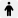
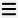

The **Body Type block** shows your hit locations and updates automatically as you equip armor or change other details on your [character sheet](Character%20Sheet%20Overview).

It includes:

- **Random roll table** for determining hit locations (p. B400).
- **Hit locations** (p. B398) with attack roll penalties.
- **Damage Resistance (DR)** values (p. B378) based on armor or protections.
- **Notes** for any important damage information.

Hover over a hit location to see tooltips for special damage effects (p. B552).

## Changing your body type

By default, GCS sets your body type to **Humanoid**. You can change it to another type, such as quadruped, avian, or arachnoid.

To change your body type:

1. On the character sheet toolbar, select **Body Type** .
2. On the Body Type toolbar, select **Menu** .
3. Choose an option from the table below.
4. On the Body Type toolbar, select **Apply Changes**  to save.

| Body Type Option        | Description                                                             |
|-------------------------|-------------------------------------------------------------------------|
| **Arachnoid**           | Spider-like body with eight legs.                                       |
| **Avian**               | Bird-like body with wings and two legs, no arms.                        |
| **Cancroid**            | Crab- or lobster-like body with pincers as forelimbs.                   |
| **Centaur**             | Humanoid torso combined with a quadruped lower body.                    |
| **Hexapod**             | Six-legged body.                                                        |
| **Hexapod, Winged**     | Six-legged body with wings.                                             |
| **Humanoid**            | Standard two-armed, two-legged body type.                               |
| **Humanoid (Low-Tech)** | Variant humanoid with low-tech hit locations (e.g., less armor detail). |
| **Ichthyoid**           | Fish-like body with fins, tail, and aquatic adaptations.                |
| **Octopod**             | Octopus-like body with eight tentacles.                                 |
| **Quadruped**           | Four-legged body (for example, a horse or wolf).                        |
| **Quadruped, Winged**   | Four-legged body with wings (for example, a pegasus).                   |
| **Scorpion**            | Scorpion-like body with claws and a stinger tail.                       |
| **Snakemen**            | Serpentine lower body with humanoid upper torso.                        |
| **Squid**               | Squid-like body with tentacles and fins.                                |
| **Vermiform**           | Worm- or serpent-like body with no limbs.                               |
| **Vermiform, Winged**   | Serpentine or worm-like body with wings.                                |

## Importing and exporting body types

You can share body type settings between characters or reuse them in different sheets by importing or exporting.

To import or export a body type:

1. On the Body Type toolbar, select **Menu** .
2. Select one of the following:
   - **Import:** Load a saved body type into your sheet.
   - **Export:** Save the current body type as a file.

## Editing your body type

You can edit your existing hit locations or add new ones.

To edit or add hit locations:

1. On the character sheet toolbar, select **Body Type** .
2. In the editor, do one of the following:
   - **Edit** an existing location.
   - Select **Add**  to add a new hit location.
3. Enter values in the form using the fields below.
4. On the Body Type toolbar, select **Apply Changes**  to save.

### Body Type fields

| Field           | Description                                                                                                                                                                                 |
|-----------------|---------------------------------------------------------------------------------------------------------------------------------------------------------------------------------------------|
| **Name**        | The body type name (for example, Humanoid).                                                                                                                                                 |
| **Roll**        | Number of dice rolled for the hit location (for example, 3d).                                                                                                                               |
| **ID**          | Unique variable name used for references.                                                                                                                                                   |
| **Choice Name** | The label shown when selecting the location for DR adjustments. For example, armor that protects the _Torso_.                                                                               |
| **Table Name**  | The label shown on the character sheet.                                                                                                                                                     |
| **Slots**       | Defines dice spans for the random roll table. For example, if **Roll = 3d**, there are 16 results (3–18). Slots assign each range (For example, 2 slots = 3–4; 1 slot = 5; 6 slots = 7–12). |
| **Hit Penalty** | Penalty to attack rolls to hit this location.                                                                                                                                               |
| **DR Bonus**    | Starting Damage Resistance for the location.                                                                                                                                                |
| **Decription**  | Notes or special damage effects. Displays as a tooltip when hovered.                                                                                                                        |
| **Sub-Roll**    | Used when adding a sub-table. Defines the dice rolled for the sub-location.                                                                                                                 |

### Sub Tables

You can create sub-tables for any hit location. These work the same way as normal hit locations and can be expanded or collapsed on the Body Type block.

To add a sub hit location:

1. On the parent hit location, select **Add Sub Table** .
2. Enter values in the form using the fields above.
3. On the Body Type toolbar, select **Apply Changes**  to save.

## Managing hit locations

- **Discard changes:** Select **Discard changes** .
- **Delete a hit location:** Select **Delete** .
- **Reorder hit locations:** Drag a hit location using its grip . Note: the order affects the dice roll table.
- **Reset body type to defaults:** Select **Reset**  to restore your hit locations to the default settings.

## Default body type

You can change the default body type for new characters in [Default Body Type](Default%20Settings).

---

[Return to Home](Home)
