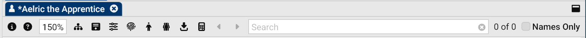

In GCS, the **character sheet** is where you add your traits, skills, spells, equipment, and other information from the [Library Explorer](Library%20Explorer) when building your GURPS character (p. B10).

See [Create your first character](Create%20your%20first%20character) for a step-by-step guide in building a character without overwhelming you with details.

## Creating a character sheet

- Select **File > New Character Sheet**. You can also press `Ctrl+N` (or `Cmd+N` on macOS) on your keyboard.

A blank character sheet opens with defaults:

- A randomly generated name and description
- All primary attributes set to 10
- A humanoid body type
- 250 unspent character points (your starting points).

You can change these defaults in [Default Settings](Default%20Settings).

## Opening a character sheet

- **From the User Library:** Double-click the sheet in the [Library Explorer](Library%20Explorer).
- **From another location:** Select **File > Open** (`Ctrl+O` / `Cmd+O`), browse to the file, and select **Open**.

## Saving a character sheet

To save your work:

- **Save:** Select **File > Save** (`Ctrl+S` / `Cmd+S`).
- **Save As:** Select **File > Save As** (`Ctrl+Shift+S` / `Cmd+Shift+S`).

> [!NOTE]
> An asterisk (`*`) on the tab means the sheet has unsaved changes.

## Exporting a character sheet

- Select **File > Export**, then choose a format:
  - **PDF** (printable sheets)
  - **PNG / JPEG / WEBP** (images)
  - **Fantasy Grounds** (VTT integration)
  - **HTML / Text** (simple exports)
  - **Obsidian Markdown** (for Obsidian vaults)

## Printing a character sheet

- Select **File > Print** (`Ctrl+P` / `Cmd+P`), choose your printer and settings, then select **Print**.

## Character sheet blocks

Your character sheet in GCS is divided into blocks, each focusing on a specific part of your character. These blocks update automatically as you add or change content, so you don’t have to calculate everything by hand.

The table below gives an overview of each block. You can click through to individual pages for a deeper dive into how each one works.

| Block                                | Description                                                                                                                                                                                                |
|--------------------------------------|------------------------------------------------------------------------------------------------------------------------------------------------------------------------------------------------------------|
| **Portrait**                         | Add an image for your character. Supports `.gif`, `.jpg`, and `.png` image formats.                                                                                                                        |
| **Identity**                         | Holds your character’s name, title, and organization.                                                                                                                                                      |
| **Description**                      | Age, appearance, birthday, religion, and tech level (p. B22). Select **Randomize**  to generate a random entry for each field.                                          |
| **Miscellaneous**                    | Shows created/last updated dates and the player’s name.                                                                                                                                                    |
| **Points**                           | Tracks your [character points](character%20points).                                                                                                                                                        |
| **Primary and Secondary Attributes** | Shows your basic attributes and secondary characteristics. See [Attributes](attributes) for details.                                                                                                       |
| **Point Pools**                      | Tracks your fatigue points (FP), hit points (HP), and other pools. See [Point pools](Point%20pools).                                                                                                       |
| **Body Type**                        | Displays your [body type](Body%20type), damage resistance (DR), and hit location table. It includes a space for notes  for the hit location (for example, “crippled”). |
| **Encumbrance, Move & Dodge**        | Shows encumbrance and movement speeds. The weight icon  indicates your current encumbrance level.                                                                          |
| **Lifting & Moving Things**          | Calculates how much weight your character can lift and carry.                                                                                                                                              |
| **Basic Damage**                     | Lists thrust and swing damage based on ST.                                                                                                                                                                 |
| **Reactions**                        | Appears only if traits or skills give your character reaction bonuses.                                                                                                                                     |
| **Conditions**                       | Appears only if traits or skills give your character conditions.                                                                                                                                           |
| **Melee Weapons**                    | Lists equipped melee weapons with their stats. See [Melee and Ranged Weapons](Melee%20and%20Ranged%20Weapons).                                                                                             |
| **Ranged Weapons**                   | Lists equipped ranged weapons with their stats. See [Melee and Ranged Weapons](Melee%20and%20Ranged%20Weapons).                                                                                            |
| **Traits**                           | Shows your advantages, disadvantages, and quirks. See [Traits](Traits).                                                                                                                                    |
| **Skills & Techniques**              | Lists your character’s skills and techniques. See [Skills](Skills).                                                                                                                                        |
| **Spells**                           | Lists spells your character knows. See [Spells](Spells).                                                                                                                                                   |
| **Equipment**                        | Tracks carried and owned equipment. Carried items can be equipped and affect encumbrance. See [Equipment](Equipment).                                                                                      |
| **Notes**                            | Free-form notes for backstory, reminders, or campaign info. See [Notes](Notes).                                                                                                                            |

## Master Library Syncing

GCS tracks whether items on your character sheet match the official **Master Library**. Look for the **Library Source Match** icon  next to items on your sheet.

- **Blank field:** Matches the Master Library.
- **Exclamation mark (`!`):** Different from the Master Library. This happens if you edited the item or if the library was updated (for example, a bug fix).
- **Dash (`-`):** Custom or imported item that isn’t part of the Master Library.

### Syncing items

By default, changes in the Master Library don’t affect your sheet. To update your sheet so it matches the library, you can resync:

- **Sync a single item:** Right-click the item and select **Sync with source**.
- **Sync everything at once:** Select **Sync with all sources**  in the character sheet toolbar.

> [!caution]  
> If you intentionally customized an item (for example, modified a skill or piece of equipment), don’t resync it or it will overwrite your changes.

## Character sheet toolbar

The toolbar above the character sheet gives you quick access to common actions:

| Button                                   | Name                    | Description                                                                                  |
|:-----------------------------------------|-------------------------|----------------------------------------------------------------------------------------------|
|            | **Help**                | Open the help page from the User Guide.                                                      |
| 100%                                     | **Zoom**                | Adjust the display size of your character sheet.                                             |
|          | **Expand/Collapse All** | Show or hide all items within containers at once.                                            |
|  | Open/Close All Notes    | Show or hide all embedded notes on your sheet.                                               |
|   | Sheet Settings          | Change settings for your character sheet. See [Sheet Settings](Sheet%20Settings).            |
|      | Attributes              | Change your Primary and Secondary [Attributes](Attributes) and [Point pools](Point%20pools). |
|        | Body Type               | Edit your character's [Body type](Body%20type).                                              |
|           | Clone                   | Creates an exact copy of your character sheet, with randomized description fields.           |
|     | Sync with all sources   | Sync all items on the character sheet with the Master Library.                               |
|      | Calculator              | Open the [calculator](calculator) to determine jumping, throwing, and hiking distances.      |
| N/A                                      | Search                  | Search for content on your character sheet.                                                  |
| Checkbox                                 | Names only              | Limit searches to names only, ignoring notes or other details.                               |

---

[Return to Home](Home)
