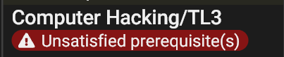

Prerequisites appear on the **Detail Editor** of [Traits](Traits), [Skills](Skills), [Spells](Spells), and [Equipment](Equipment). They define the requirements your character must meet before taking or using the item.

## Unmet prerequisites

If you add something to your [character sheet](Character%20Sheet%20Overview) without meeting its requirements, GCS shows an error message below it.

Hover over the error to see what's missing.

## Adding prerequisites

To add a prerequisite:

1. Open the **Detail Editor** for the trait, skill, or spell.
2. In the Prerequisite list, select **Add** .

To add a sub-list at a specific level:

- Select **Add child**  next to that prerequisite.

To delete a requirement:

- Select **Delete** .

## How a prerequisite is built

In the editor, prerequisites are built from a mix of **dropdown menus** and **text/number fields**.

- Use the dropdowns to choose the type of requirement and comparison rule.
- Type the specific details (like a trait name, equipment tag, or minimum level) into the fields that appear.

1. Every prerequisite starts with a **Tech Level rule** (for example, _When the Tech Level is anything_).
2. Next, choose how multiple conditions combine:
   - **requires all of** (all conditions must be true).
   - **requires at least one of** (at least one condition must be true).
3. Add specific requirements, such as a trait, attribute, skill, spell, or piece of equipment.
4. For each target, fill in the required details:
   - Select comparison rules from dropdowns (for example, _is at least_).
   - Enter names, text, or numbers in the fields.

> [!WARNING]
> When typing names (traits, skills, spells, equipment), you must match the name **exactly** as it appears in the library or on your sheet. Typos or mismatches mean the prerequisite won’t be recognized.

The choices you make when adding a prerequisite are defined by two parts:

- The **operator** (how the rule is compared).
- The **target** (what the rule applies to).

## Operators

Operators define how the prerequisite is checked. These appear in dropdowns when you select how to compare values.

Some are for numbers, others for text. The available operators depend on the type of field (text vs. numeric) and target.

See [Operators](Operators) for a full list.

## Targets

Targets define what the prerequisite applies to. These appear in dropdowns when you choose the requirement type. The fields you see depend on the target you are selecting.

Every prerequisite begins with **has** or **does not have**, then defines what that applies to.

### Trait

Requires that a character **has** or **does not have** a trait.

- **Name**: Compare the trait name (_is_, _is not_, _contains_, _starts with_, _ends with_). Enter the name in the text field.
- **Notes**: Compare the trait’s notes (_is anything_, _contains_, etc.). Enter note text in the text field.
- **Level**: Compare the trait’s level (_is at least_, _is at most_). Enter the required level.

### Attribute

Requires that a character **has** or **does not have** a certain attribute level.

- **Attribute**: Choose from the list (for example, ST, DX, Will, Vision).
- **Combine with**: Optionally select a second attribute (for example, ST+DX).
- **Comparison**: Choose a numeric rule (_is at least_, _is at most_).
- **Level**: Enter the required level.

### Equipped equipment

Requires that a character **has** or **does not have** a specific piece of equipment equipped.

- **Name**: Compare the equipment name (_is_, _is not_, _contains_, etc.). Enter the name in the text field.
- **Tags**: Require _at least one tag_ or _all tags_. Enter [Tags](Tags) in the text field.

### Skill

Requires that a character **has** or **does not have** a skill.

- **Name**: Compare the skill name (_is_, _is not_, _contains_, etc.). Enter the name in the text field.
- **Specialization**: Optionally compare the specialization (_is anything_, _contains_, etc.). Enter text in the field.
- **Level**: Compare the skill’s level (_is at least_, _is at most_). Enter the required level..

### Spell

Lets you require spells by name, college, tag, or count.

- **Count**: Choose _exactly_, _at least_, or _at most_, then enter a number of spells.
- **Filter**: Narrow the requirement by name, tag, college, different colleges, or any kind.
- **Comparison**: Choose a text or number rule.
- **Value**: Enter the name, tag, or number.

### Script

Requires a custom script to check the prerequisite. See the scripting guide  for more details.

- The script must return an **empty string** (`""`) if the prerequisite is met.
- If the prerequisite is not met, return a **string describing what is missing**.
- Useful for exotic prerequisites that can’t be expressed with the standard types.

> [!IMPORTANT]
> Scripts are evaluated much more slowly than other prerequisite types. Use this option only when no other type can model the requirement.

## Sub-lists

A sub-list is a **group of prerequisites nested inside another rule**. Use them to build complex conditions.

- A sub-list always starts with either **requires all of** or **requires at least one of**.
- Inside the sub-list, you can add any number of prerequisites (traits, attributes, skills, etc.).
- Sub-lists can be nested inside each other for very complex logic.

**_Example:_** Requires ST 12+ **and one of** (Magery 1, Power Investiture 1, **or** Gadgeteer).

> [!TIP]  
> Use sub-lists when you want **multiple ways** to qualify for something, or when a rule requires **several conditions at once.**

## Saving prerequisites

On the Detail Editor toolbar:

- **Apply changes**: Select **Apply Changes**  to save.
- **Discard changes**: Select **Discard changes**  to exit without saving.

---

[Return to Home](Home)
