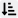

**Trait Modifiers** ([B101](B101)) can be applied to [Traits](Traits) as either **enhancements** or **limitations**. These adjust the base cost of a trait.

### Master Library

GCS includes libraries of official trait modifiers in the **Master Library** that are taken from GURPS books and other supplements. See [Library Explorer](Library%20Explorer) for more details.

You can also create your own custom trait modifiers.

## Trait Modifier list

The **Trait Modifier** section in the Trait Detail Editor includes the following columns. Select a column heading to sort ascending  or descending .

| Column                                    | Description                                                                                                                                                    |
|-------------------------------------------|----------------------------------------------------------------------------------------------------------------------------------------------------------------|
|   | If checked, the modifier is **enabled** and its effects apply to the trait.                                                                                    |
| **Trait Modifier**                        | The modifier’s name and any notes. Select the notes icon  to open or close the notes.                                   |
| **Cost Adjustment**                       | The calculated adjustment to the trait’s [character point](Character%20points) cost.                                                                           |
| **Tags**                                  | Tags used to help organize modifiers.                                                                                                                          |
|  | Page reference for the modifier. See [Page References](Page%20References).                                                                                     |
|         | Tracks whether the modifier matches the official **Master Library**. See _Master Library Syncing_ in [Character Sheet Overview](Character%20Sheet%20Overview). |

## Adding trait modifiers

You must add modifiers to an existing [Trait](Traits).

To add a modifier:

1. Open the **Trait Detail Editor** for the trait you want to modify.
2. Open a Modifier library from the **Master Library**.
3. Drag the modifier to the **Trait Modifier** section in the editor (note: you must drag it to the precise location on the Detail Editor).

You can also create a new custom modifier:

- Open the Trait Detail Editor for the trait you want to modify.
- Go to **Item > New Trait Modifier**.

> [!NOTE]
> Some traits support multiple modifiers. When you first add a trait that has modifiers, GCS prompts you to select them. You can select one, several, or none. If you skip this step, you can add or edit modifiers later in the **Trait Detail Editor**.

## Managing modifiers

You can manage modifiers directly in the Trait Detail Editor:

- **Enable/disable:** Check or uncheck the box to apply or remove a modifier’s effects.
- **Delete:** Select the modifier and choose **Delete** .

> [!TIP]
> Some modifiers include **placeholders** (for example, `@condition@`). You can set these when first adding the modifier, or later with **Set Substitutions**  in the toolbar.

## Editing trait modifiers

You can edit a trait modifier in a few ways:

- Double-click it to open the **Detail Editor** for trait modifiers.
- Right-click it and select **Open Detail Editor**.
- Select a trait modifier and go to **Edit > Open Detail Editor**.

Save your changes when you're done from the **Trait modifier toolbar** (see below).

## Trait Modifier Detail Editor fields

The Trait Modifier Detail Editor includes the following fields:

| Trait Modifier field                | Description                                                                                                                                |
|-------------------------------------|--------------------------------------------------------------------------------------------------------------------------------------------|
| **Name**                            | The trait modifier's name.                                                                                                                 |
| **Notes**                           | Notes about what the trait modifier does. These appear below the trait on your character sheet. Supports [Markdown](Markdown%20Guide).     |
| **Also show notes in weapon usage** | If checked, notes also appear in the weapon usage section.                                                                                 |
| **VTT Notes**                       | Notes for use in your Virtual Tabletop system. See your VTT’s documentation.                                                               |
| **Enabled**                         | If checked, the modifier is active and applies its effects.                                                                                |
| **Cost**                            | The modifier’s cost. Can be a percentage, a flat point cost (±), an adjustment to base cost, leveled cost, or a multiple (×2 or ×2/3).     |
| **Level**                           | The level of the modifier, if applicable.                                                                                                  |
| **Use level from owner**            | If checked, the modifier’s level is linked to the parent trait’s level.                                                                    |
| **Total**                           | Read-only. The total calculated cost adjustment from this modifier.                                                                        |
| **Tags**                            | Comma-separated tags to help organize modifiers.                                                                                           |
| **Page Reference**                  | Page number for the trait. See [Page References](Page%20References) for details.                                                           |
| **Page Highlight**                  | Text to highlight in the PDF. Leave blank unless the default highlights fail.                                                              |
| **ID**                              | The modifiers’s unique ID.                                                                                                                 |
| **Source ID**                       | The unique ID for the modifier in the source library.                                                                                      |
| **Source Library**                  | The name of the source library.                                                                                                            |
| **Source Path**                     | The path to the source library.                                                                                                            |
| **Features**                        | Lists attribute, conditions, skill, spell, reaction, or weapon changes applied by the modifier. See [Features](Features) for more details. |

## Trait Modifier toolbar

The toolbar above the Trait Modifier Editor gives you quick access to common actions:

| Button                                     | Name                | Description                                            |
|--------------------------------------------|---------------------|--------------------------------------------------------|
|            | **Help**            | Opens the help page from the User Guide.               |
| 100%                                       | **Zoom**            | Adjusts the display size of the Trait Modifier Editor. |
|    | **Apply Changes**   | Saves and closes the Trait Modifier Editor.            |
|  | **Discard Changes** | Exits without saving changes.                          |

---

[Return to Home](Home)
